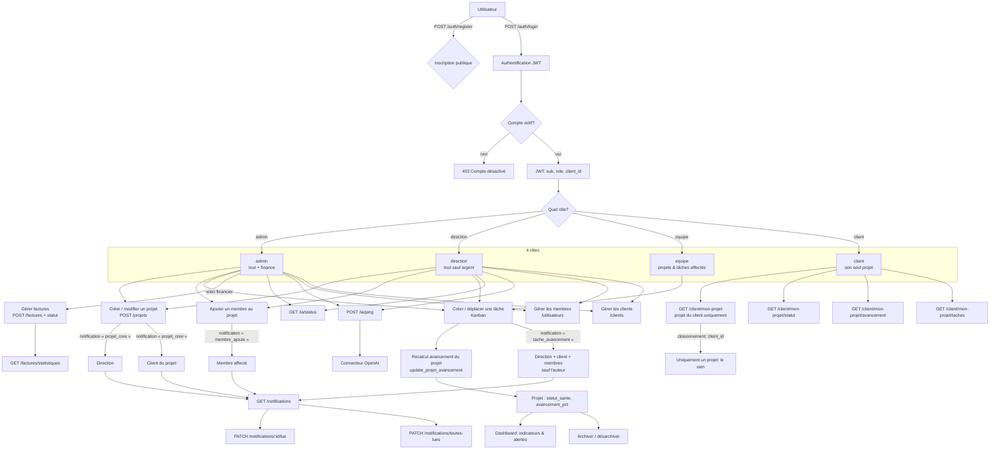
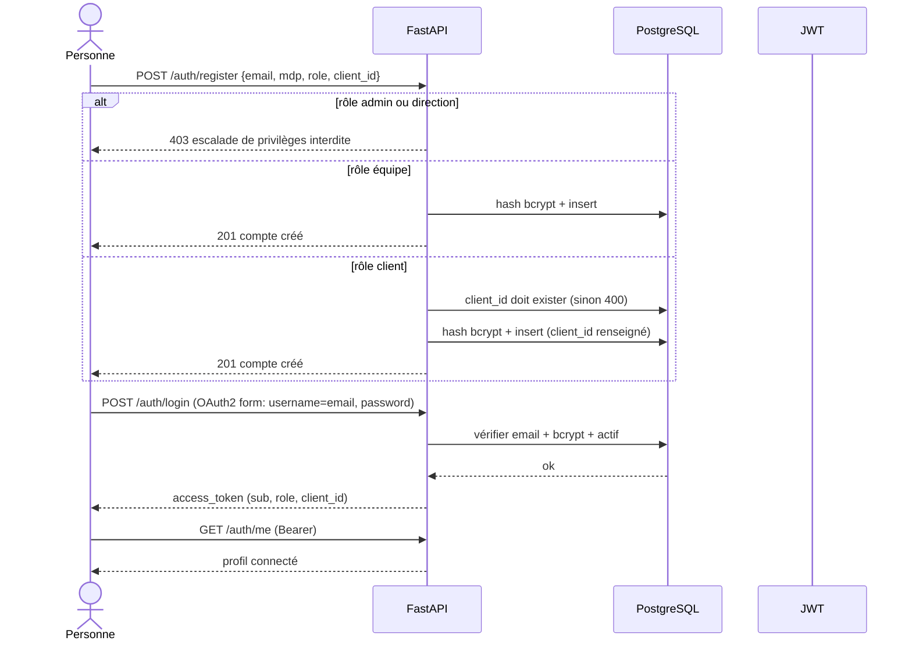
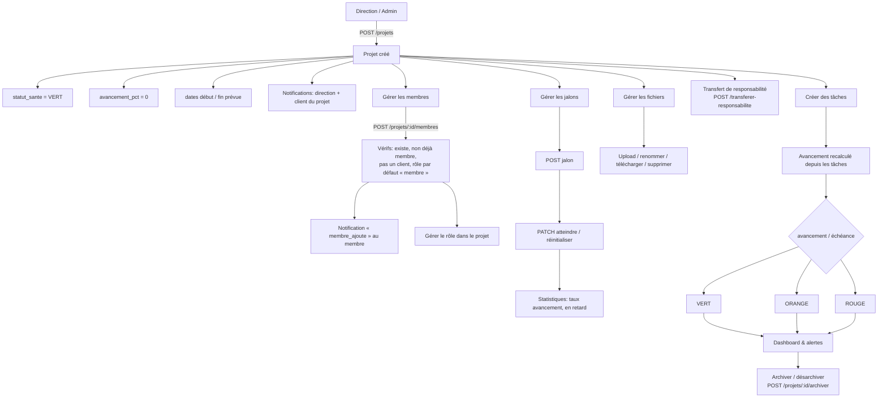
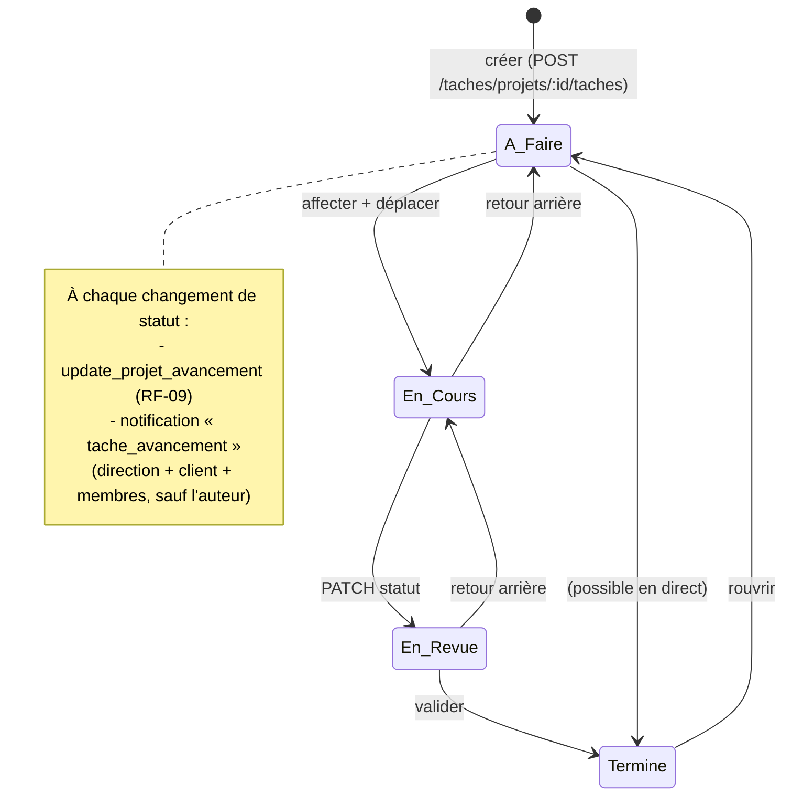
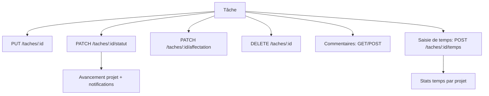
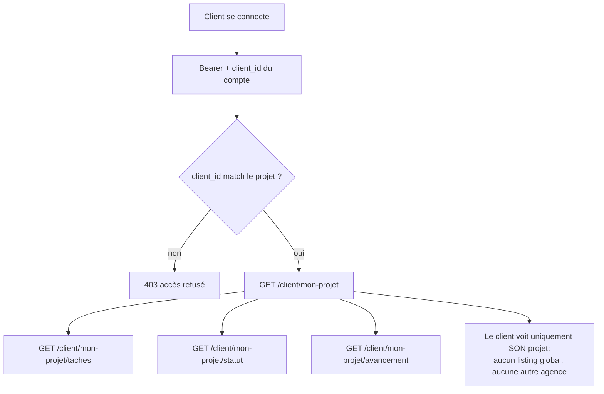
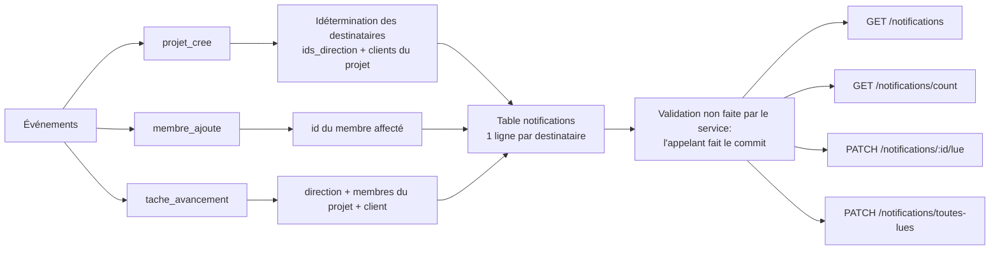
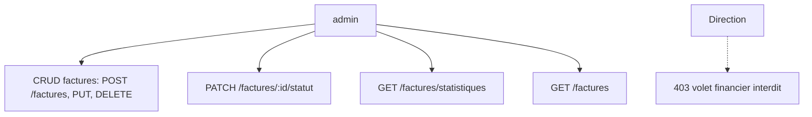
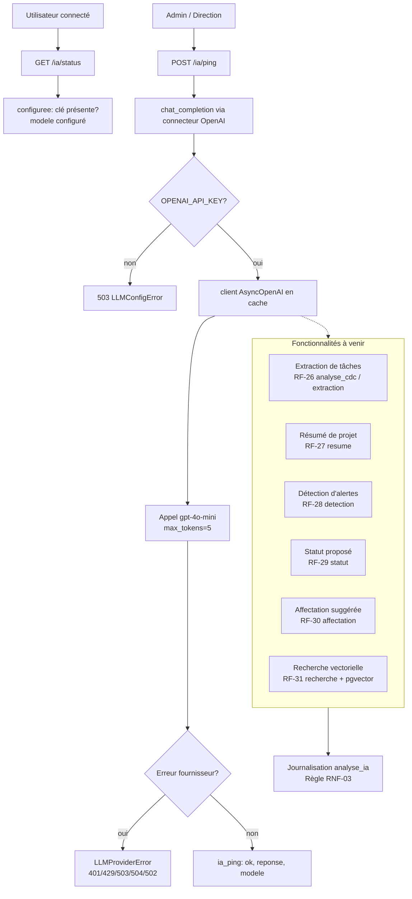

# Diagramme de flux — i-Rindra (Gestion de projets)

Diagrammes Mermaid des parcours de bout en bout de l'application.
Rendus nativement sur GitHub / GitLab ; ou sur https://mermaid.live (coller).

---

## 1. Vue d'ensemble (flux complet)

---

## 2. Authentification & rôles

---

## 3. Cycle de vie d'un projet

---

## 4. Tâches — Tableau Kanban

Détail des actions sur une tâche :

---

## 5. Espace client (cloisonnement)

---

## 6. Notifications

---

## 7. Facturation (volet admin uniquement)

---

## 8. Module IA

---

## 9. Légende des rôles

| Rôle | Accès |
|---|---|
| **admin** | Tout, y compris le volet financier (factures) |
| **direction** | Tout sauf l'argent ; gère projets, membres, clients |
| **equipe** | Ses projets (responsable ou membre) + tâches affectées |
| **client** | Uniquement son projet (`/client/*`) |